# HandsOnWireshark

<table>
<tbody>
  <thead>
    <tr>
      <th>Name</th>
      <th>NRP</th>
    </tr>
  </thead>
  <tbody>
    <tr>
      <td>Thalent Athalla Razzaq</td>
      <td>5025211101</td>
    </tr>
  </tbody>
</table>

## TCP

### 1. What is the IP address and TCP port number used by the client computer (source) that is transferring the alice.txt file to gaia.cs.umass.edu?

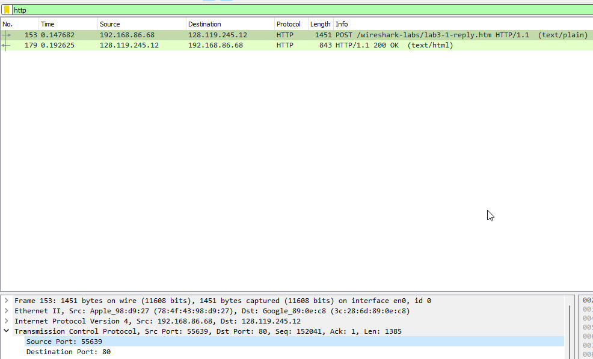

```
IP Address: 192.168.18.17
Port: 50229
```

### 2. What is the IP address of gaia.cs.umass.edu? On what port number is it sending and receiving TCP segments for this connection?

```
IP Address: 128.119.245.12
Port: 80
```

### 3. What is the sequence number of the TCP SYN segment that is used to initiate the TCP connection between the client computer and gaia.cs.umass.edu?

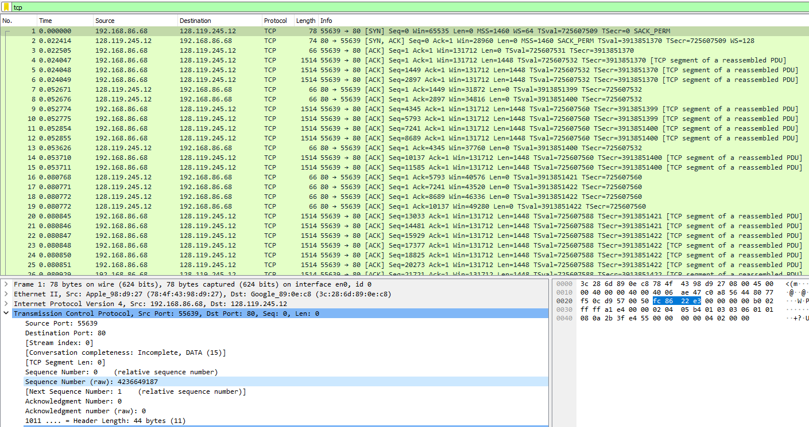

```
Sequence Number (Raw): 4236649187
```

### 4. What is the sequence number of the SYNACK segment sent by gaia.cs.umass.edu to the client computer in reply to the SYN? What is it in the segment that identifies the segment as a SYNACK segment? What is the value of the Acknowledgement field in the SYNACK segment?

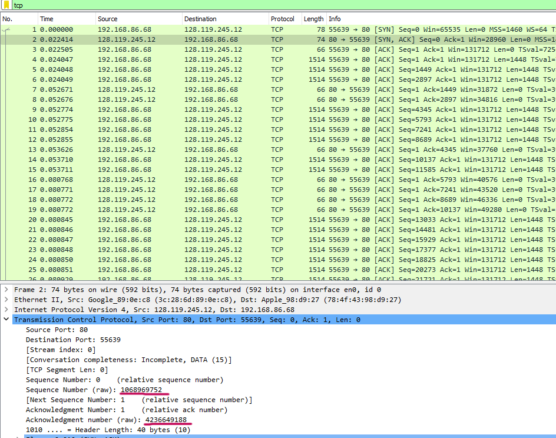

```
Sequence Number (Raw): 1068969752
Acknowledgement Number (Raw): 4236649188
```

### 5. What is the sequence number of the TCP segment containing the header of the HTTP POST command? How many bytes of data are contained in the payload (data) field of this TCP segment? Did all of the data in the transferred file alice.txt fit into this single segment?

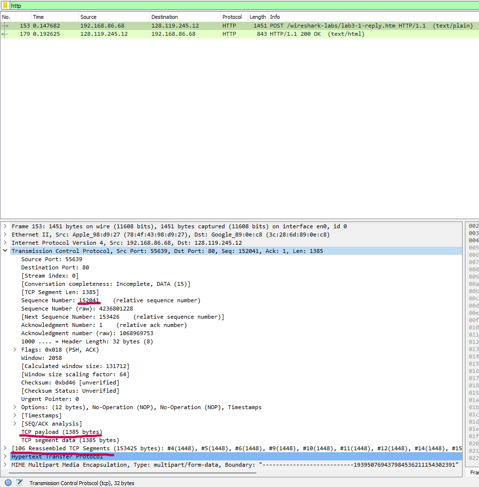

```
Sequence Number: 152041
TCP Payload: 1385 bytes
```
The program was reasambled into `106` segments.

### 6. Consider the TCP segment containing the HTTP "POST" as the first segment in the data transfer part of the TCP connection.

- At what time was the first segment (the one containing the HTTP POST) in
the data-transfer part of the TCP connection sent?

  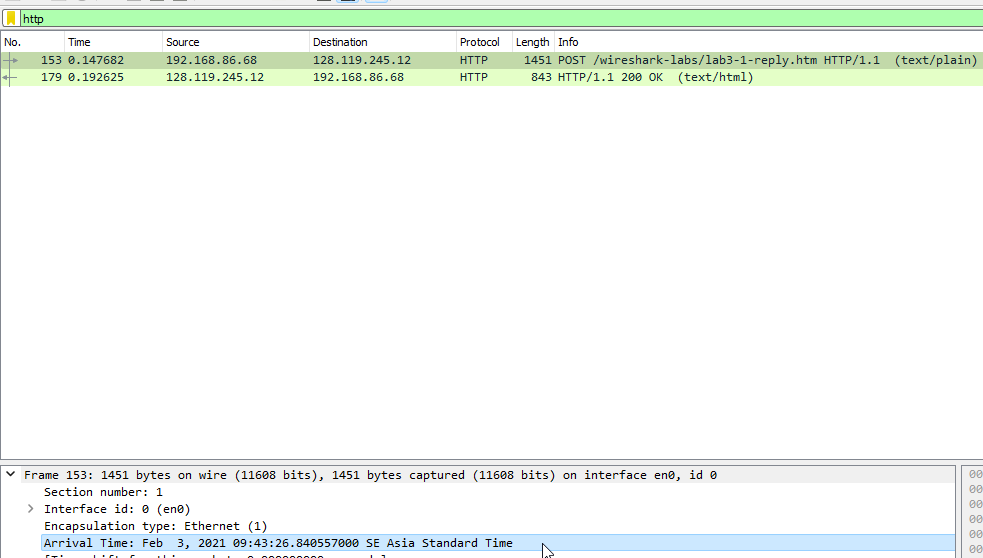

  ```
  Arrival Time: Feb  3, 2021 09:43:26.840557000 SE Asia Standard Time
  ```

- At what time was the ACK for this first data-containing segment received?

  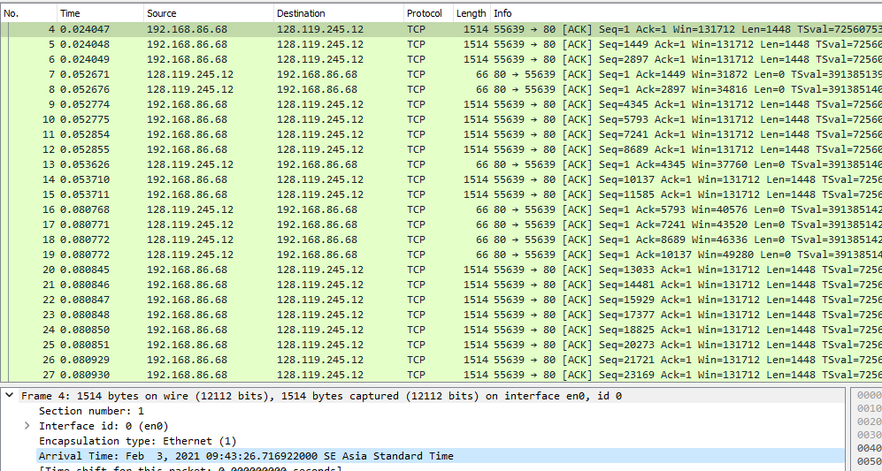

  ```
  Arrival Time: Feb  3, 2021 09:43:26.716922000 SE Asia Standard Time
  ```

- What is the RTT for this first data-containing segment?

  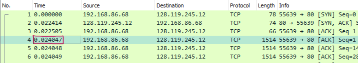

  ```
  Time: 0.024047
  ```

- What is the RTT value the second data-carrying TCP segment and its ACK?

  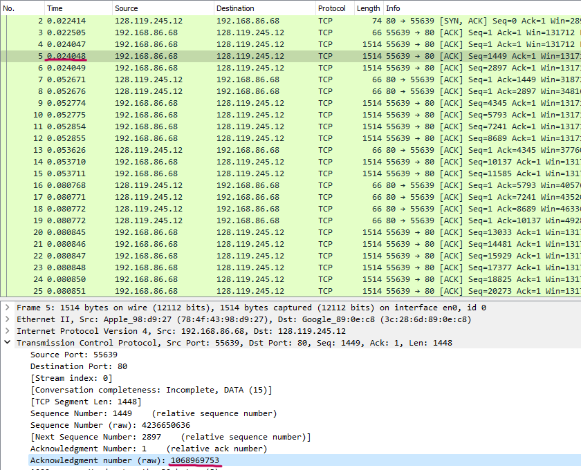

  ```
  Time: 0.024048
  Acknowledgment number (raw): 1068969753
  ```

- What is the EstimatedRTT value after the ACK for the second data-carrying segment is received?

  🤷

### 7. What is the length (header plus payload) of each of the first four data-carrying TCP segments?

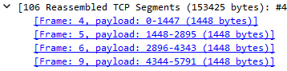
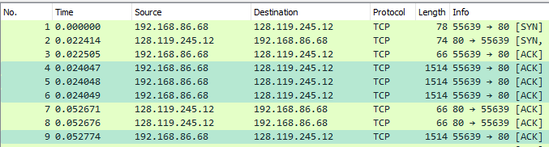

```
Each length is: 1514
```

### 8. What is the minimum amount of available buffer space advertised to the client by gaia.cs.umass.edu among these first four data-carrying TCP segments? 

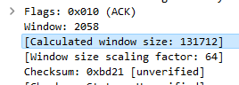

```
Calculated window size: 131712 bytes
```

### 9. Are there any retransmitted segments in the trace file? What did you check for (in the trace) in order to answer this question?

There are not any restransmitted segments in the trace file. I checked the `tcp.analysis.retransmission` filter.

### 10. How much data does the receiver typically acknowledge in an ACK among the first ten data-carrying segments sent from the client to gaia.cs.umass.edu? Can you identify cases where the receiver is ACKing every other received segment among these first ten data-carrying segments?

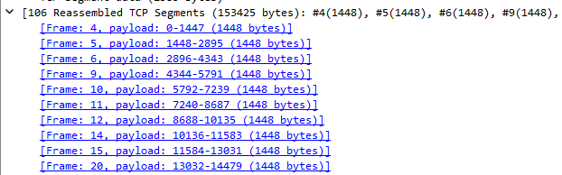

```
The receiver typically acknowledge 1448 bytes of data.
```

### 11. What is the throughput (bytes transferred per unit time) for the TCP connection? Explain how you calculated this value.

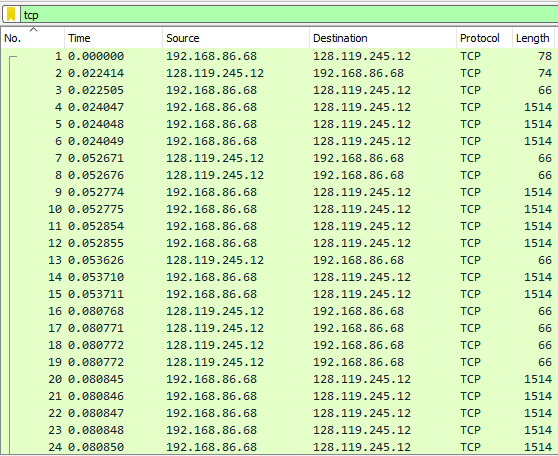

- First we determine the amount of data transferred by the client to the server. For this example, I chooese frame number 1 to 24. The total amount of data transferred is 21876 bytes.
- Then, we calculate the amount of time it takes to transfer the data. The time is 0.080850 seconds.
- To calculate the throughput, we divide the amount of data transferred by the amount of time it takes to transfer the data. The throughput is about 270,000 bytes/second.

### 12. Use the Time-Sequence-Graph(Stevens) plotting tool to view the sequence number versus time plot of segments being sent from the client to the gaia.cs.umass.edu server. Consider the "fleets" of packets sent around t = 0.025, t = 0.053, t = 0.082 and t = 0.1. Comment on whether this looks as if TCP is in its slow start phase, congestion avoidance phase or some other phase.

### 13. These "fleets" of segments appear to have some periodicity. What can you say about the period?

### 14. Answer each of two questions above for the trace that you have gathered when you transferred a file from your computer to gaia.cs.umass.edu

## UDP

###